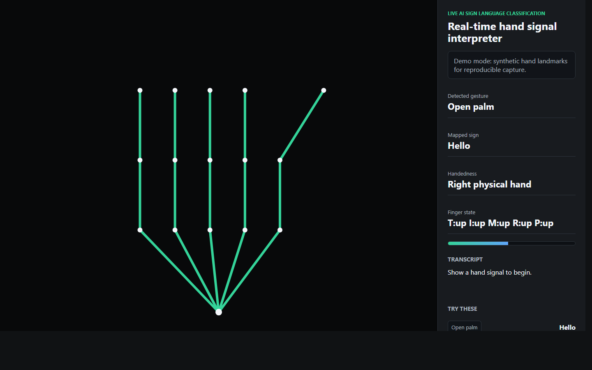
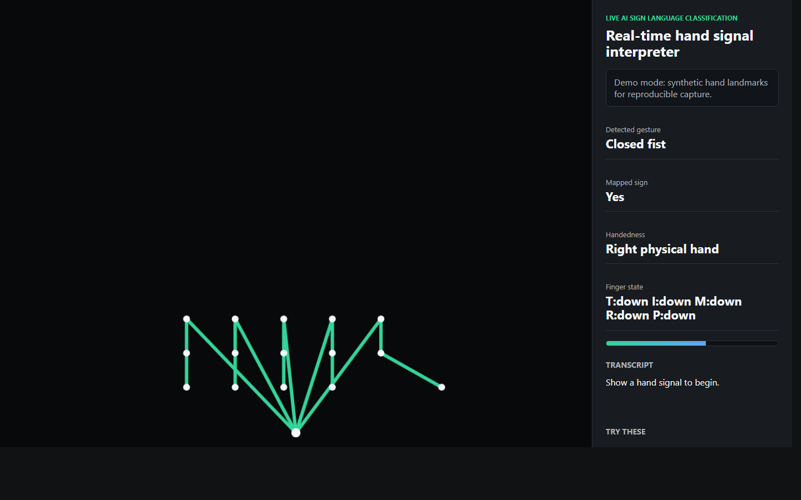
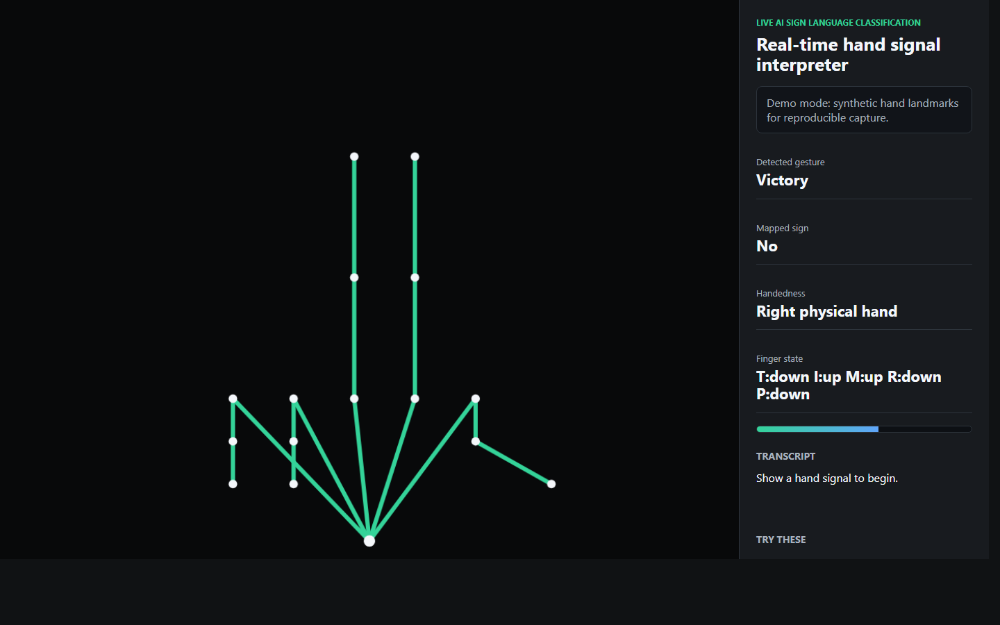
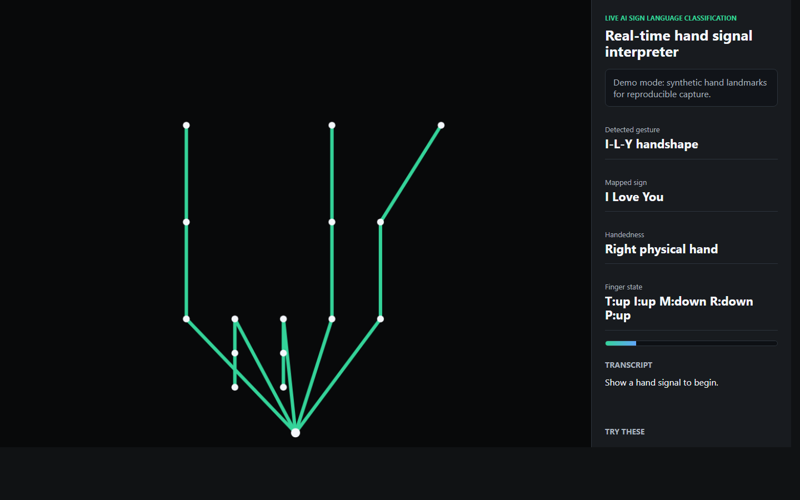

# Live AI Sign Language Classification

A C++17 sign language classification demo with a browser-based live webcam showcase. The project combines a native C++ landmark classifier, sample replay data, prediction smoothing, and a MediaPipe-powered web interface for hand tracking.

This project is intended as a practical learning build. It demonstrates how live hand landmark data can be normalized, classified, smoothed, displayed, and documented as a complete software project.

## Demo Artifacts

Screenshots generated from the deterministic browser demo mode:

Demo video:

[Watch the generated MP4 demo](docs/demo/live-ai-sign-language-classification-demo.mp4)

## What The Application Does

The native C++ application reads normalized hand landmark features and classifies them against prototype sign vectors. It displays the current prediction, confidence, candidate rankings, smoothed output, and a transcript.

The browser showcase opens a real-time camera interface. It uses MediaPipe Hands to detect hand landmarks, derives finger extension states, corrects handedness for the mirrored selfie view, and maps common hand shapes to demo sign labels.

Supported demo signs:

- Hello from an open palm
- Yes from a closed fist or thumbs-up style hand shape
- No from a two-finger victory hand shape
- I Love You from the I-L-Y hand shape

## Important Accuracy Note

This is not a production ASL translation system. The browser showcase uses hand landmarks and rule-based finger-state heuristics. It is useful for learning and demonstration, but full sign language recognition requires a trained model, temporal motion understanding, signer variation handling, and a much larger labeled dataset.

The I Love You sign is detected explicitly as:

- Thumb up
- Index finger up
- Middle finger down
- Ring finger down
- Pinky up

The UI shows this as a finger-state readout such as:

    T:up I:up M:down R:down P:up

## Project Structure

    LiveAISignLanguageClassification/
      CMakeLists.txt
      README.md
      data/
        sample_frames.csv
        sign_prototypes.csv
      docs/
        demo/
        screenshots/
      include/ai_sign/
        Classifier.hpp
        FrameSource.hpp
      scripts/
        build-mingw.bat
        open-showcase.ps1
      showcase/
        app.js
        index.html
        styles.css
      src/
        Classifier.cpp
        FrameSource.cpp
        main.cpp

## Build The C++ App

Using CMake:

    cmake -S . -B build
    cmake --build build --config Release

Using a MinGW-style compiler directly:

    scripts\build-mingw.bat

If g++ is not on PATH:

    scripts\build-mingw.bat C:\path\to\g++.exe

## Run The C++ App

From the project root:

    .\LiveAISignLanguageClassification.exe

Useful options:

    --prototypes <path>   Prototype landmark CSV file.
    --input <path>        Live or replayed landmark frame CSV file.
    --synthetic           Ignore input CSV and generate a synthetic live stream.
    --iterations <n>      Number of frames to process. Default: 100.
    --speed-ms <n>        Delay between frames. Default: 160.
    --no-clear            Print frames continuously instead of refreshing the console.
    --help                Show usage.

## Open The Live Browser Showcase

Run:

    powershell.exe -ExecutionPolicy Bypass -File scripts\open-showcase.ps1

Then open or use:

    http://127.0.0.1:8765/showcase/

Allow camera access in the browser. The page displays the camera feed, hand skeleton overlay, detected gesture, mapped sign, physical handedness, finger state, confidence, and transcript.

## Deterministic Demo Mode

The showcase also supports a deterministic mode for screenshots and documentation. It does not use the webcam. Instead, it renders synthetic hand states into the same UI.

Examples:

    http://127.0.0.1:8765/showcase/?demo=1&scene=hello
    http://127.0.0.1:8765/showcase/?demo=1&scene=yes
    http://127.0.0.1:8765/showcase/?demo=1&scene=no
    http://127.0.0.1:8765/showcase/?demo=1&scene=ily

## Data Format

Prototype CSV format:

    label,display,f0,f1,...,f11
    HELLO,Hello,0.10,0.88,...

Frame replay CSV format:

    frame_id,source_label,f0,f1,...,f11
    demo-001,HELLO,0.11,0.87,...

Each row represents normalized numeric hand-landmark features.

## How The Classifier Works

The C++ classifier uses a nearest-prototype approach:

1. Load prototype signs from CSV.
2. Load or generate landmark frames.
3. Compute normalized distance from the current frame to each prototype.
4. Convert distances into confidence-like scores.
5. Sort top candidates.
6. Smooth predictions over a short window.
7. Append stable sign changes to the transcript.

The browser showcase uses a different live path:

1. MediaPipe Hands detects 21 landmarks from the webcam.
2. The app estimates finger extension scores.
3. It maps finger-state patterns to demo signs.
4. It corrects left and right hand labels for the mirrored camera view.
5. It updates the UI and transcript in real time.

## Skills Learned And Implemented

- C++17 project organization with headers, source files, and CMake.
- Console application design with command-line options.
- CSV parsing and validation for training-like prototype data.
- Feature-vector comparison with normalized Euclidean distance.
- Confidence scoring from model distances.
- Prediction smoothing to reduce frame-to-frame jitter.
- Transcript generation from stable sign changes.
- Separation of classifier logic from frame-source logic.
- Synthetic data generation for repeatable testing.
- Browser-based camera capture with MediaPipe Hands.
- Hand landmark visualization with canvas overlays.
- Finger-state heuristic classification for common hand shapes.
- Mirrored camera handedness correction.
- Responsive frontend layout for live visual feedback.
- Deterministic demo mode for documentation and screenshots.
- Git repository setup, ignore rules, and generated artifact management.
- Demo asset generation with headless Chrome and FFmpeg.

## Limitations And Future Improvements

- Replace rule-based browser signs with a trained model.
- Add OpenCV or a native camera pipeline to the C++ application.
- Export MediaPipe landmarks directly into the C++ classifier.
- Add temporal sequence recognition for motion-based signs.
- Add unit tests for CSV loading, distance scoring, and smoothing.
- Expand signs beyond the current demonstration set.
- Improve calibration for different hands, lighting, and camera angles.

## Repository Name Suggestion

Recommended GitHub repository name:

    realtime-sign-language-classifier